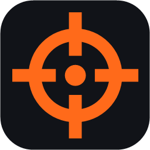
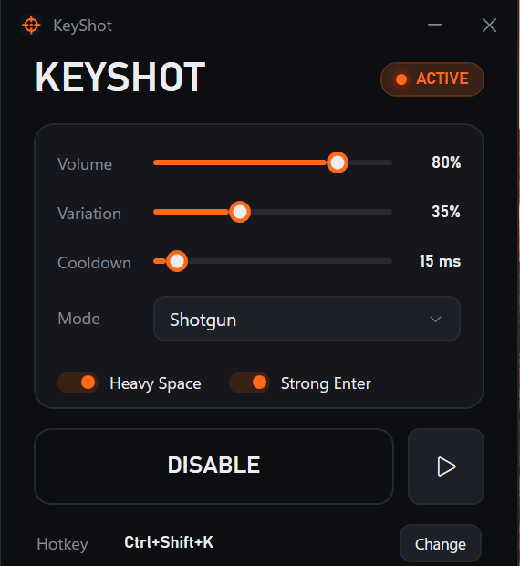

<p align="center">
  
</p>

<h1 align="center">KeyShot</h1>

<p align="center"><b>Every keystroke is a gunshot.</b><br/>
A tiny, low-latency Windows utility that plays shotgun sound effects as you type, in every app.</p>

<p align="center">
  <a href="https://github.com/prabindersinghh/keyshot-typing/actions/workflows/ci.yml"></a>
  <a href="https://github.com/prabindersinghh/keyshot-typing/releases/latest"></a>
  <a href="LICENSE"></a>
  
</p>

<p align="center">
  
</p>

---

## Features

- **Global**: works in every Windows app (editors, browsers, chat, terminals), not just one program.
- **Very low latency**: samples are pre-decoded to the sound card's native format, and one WASAPI stream
  stays open. A key press reaches the audio driver in about 11 ms (measured; see
  [performance testing](docs/PERFORMANCE_TESTING.md)).
- **Never touches your input**: KeyShot only *listens*. It never blocks, delays, changes or injects keystrokes.
- **Overlapping shots** with random sample choice and small pitch/volume variation, so it doesn't sound robotic.
- **Heavy Space, Strong Enter**: bigger shots for the big keys (optional).
- **Smart filtering**: ignores modifiers, shortcuts (Ctrl+C), key auto-repeat and keystrokes generated by other software.
- **Global hotkey** to toggle (default **Ctrl+Shift+K**), a **tray icon**, and a minimal dark UI.
- **Zero cost when off**: when disabled, the keyboard hook is removed and the audio stream is closed.
- **Sound packs**: drop a folder of `.wav`/`.mp3` files into `Sounds/` and pick it from **Mode**.
- Optional **VS Code extension** with a status-bar toggle.

## Download

1. Download the latest **`KeyShot-win-x64.zip`** from [Releases](https://github.com/prabindersinghh/keyshot-typing/releases/latest).
   It's self-contained, so nothing else needs installing. If you already have the
   [.NET 10 Desktop Runtime](https://dot.net/download), the smaller `KeyShot-win-x64-framework.zip` works too.
2. Extract it anywhere and run **`KeyShot.exe`**.
3. Press **ENABLE** (or **Ctrl+Shift+K** anywhere) and start typing.

> The exe isn't code-signed yet, so Windows SmartScreen may say *"Windows protected your PC"*. Click
> **More info → Run anyway**. On PCs with **Smart App Control** on, Windows may refuse to run unsigned
> apps at all; build from source instead (below).

## Build & install from source

Requirements: Windows 10/11 x64 and the [.NET 10 SDK](https://dot.net/download).

```powershell
git clone https://github.com/prabindersinghh/keyshot-typing.git
cd keyshot-typing
powershell -ExecutionPolicy Bypass -File scripts\install.ps1 -Launch
```

This publishes KeyShot to `%LOCALAPPDATA%\Programs\KeyShot`, creates **Desktop** and **Start Menu**
shortcuts, and starts it. Add `-Autostart` to start KeyShot (minimized) with Windows.

```powershell
dotnet build KeyShot.sln -c Release
dotnet test  KeyShot.sln
# optional: tests that play sound on the real device and measure latency
$env:KEYSHOT_DEVICE_TESTS = "1"; dotnet test KeyShot.sln --filter DeviceTests
```

Run without installing: `dotnet run --project src/KeyShot.App`.

## Usage

| Control | What it does |
|---|---|
| **ENABLE / DISABLE** | Turns shots on or off (state is remembered) |
| **Volume** | Master volume |
| **Variation** | Random pitch (up to ±2 semitones) and volume spread per shot |
| **Cooldown** | Minimum time between shots (0–250 ms) |
| **Mode** | Sound pack (folder under `Sounds/`) |
| **Heavy Space / Strong Enter** | Bigger shots for Space and Enter |
| ▷ | Test shot |
| **Hotkey → Change** | Press a new combination (Esc cancels) |

Closing the window keeps KeyShot running in the tray. Right-click the tray icon for **Enable**, **Disable**,
**Settings** and **Exit**.

Command line (also forwards to an already-running instance):

```text
KeyShot.exe [--enable | --disable | --toggle] [--minimized]
```

Settings are saved in `%APPDATA%\KeyShot\settings.json`. Advanced options that aren't in the UI
(`FireOnOtherKeys`, `FireOnModifiers`, `IgnoreShortcuts`, `IgnoreInjected`, `IgnoreAutoRepeat`,
`AudioLatencyMs`, `CloseToTray`) can be edited there.

## Sound packs

KeyShot ships with one pack, **Shotgun**: three original shotgun blasts **synthesized from scratch** by
[`scripts/generate-sounds.ps1`](scripts/generate-sounds.ps1) and released as **CC0** (public domain).
Each blast has three layers: a mid-range noise *crack*, a falling sine *boom*, and a stereo *room* tail.

Add your own packs by creating a folder next to `KeyShot.exe`:

```text
Sounds/
  Shotgun/            ← bundled
    shotgun-1.wav       one or more files, picked at random per keystroke
  MyPack/
    shot1.wav
    shot2.wav
    space-boom.wav    ← optional: files starting with "space" play on Space
    enter-burst.wav   ← optional: files starting with "enter" play on Enter
```

Restart KeyShot and choose the pack in **Mode**. Leading silence is trimmed automatically.

### Cutting packs from raw recordings

[`scripts/make-pack.py`](scripts/make-pack.py) slices raw recordings (any format ffmpeg reads) into
ready-to-use samples. It snaps each cut to the real attack, fades the tail, removes DC offset and
normalizes levels. You describe the cuts in a JSON recipe:

```json
{ "source_dir": "sounds-raw",
  "packs": { "Laser Pistol": [
    { "src": "laser.mp3", "name": "pew-1",        "start": 2246, "end": 2470, "fade_out": 40 },
    { "src": "laser.mp3", "name": "enter-volley", "start": 2973, "end": 3680, "fade_out": 80 } ] } }
```

```powershell
python scripts\make-pack.py my-recipe.json      # needs numpy + ffmpeg
```

> Check the license of any sound you add. Many free-sound sites allow use in apps but **not** redistribution
> of the raw files, so don't commit such packs to a public fork. This repo's `.gitignore` keeps everything except
> `Sounds/Shotgun` local by default.

## Architecture

```text
KeyShot.App    WPF UI, tray, hotkey, control pipe, composition root
KeyShot.Input  WH_KEYBOARD_LL hook on a dedicated high-priority thread
KeyShot.Audio  Sample decoding, lock-free polyphonic mixer, WASAPI output
KeyShot.Core   Key classification, filtering, cooldown, settings, IKeyEffect
```

See [docs/ARCHITECTURE.md](docs/ARCHITECTURE.md) for the data flow, threading model and latency budget.

## Privacy & safety

KeyShot reacts to *which kind* of key was pressed (letter, Space, Enter…). It does not record, store, log or
transmit what you type, and it never sends keyboard input to Windows. Diagnostics count key presses only.

## Limitations

- Keys typed into windows running **as administrator** aren't seen unless KeyShot also runs elevated
  (a Windows security boundary called UIPI).
- **Bluetooth headphones** add about 100–250 ms of radio/codec delay that no app can remove. Use wired
  headphones or speakers for instant shots.
- On small screens at high display scaling, the window may open partly off-screen; drag it by the title bar.

## Contributing

PRs are welcome. New sound packs (with redistributable licenses), effects and fixes are all good places to start.
Read [CONTRIBUTING.md](CONTRIBUTING.md) and the [Code of Conduct](CODE_OF_CONDUCT.md). Report security issues
privately as described in [SECURITY.md](SECURITY.md).

## License

[MIT](LICENSE) for the code. The bundled sounds are CC0. See [THIRD_PARTY_NOTICES.md](THIRD_PARTY_NOTICES.md).

KeyShot (this project) isn't affiliated with or endorsed by Luxion or its KeyShot® 3D rendering software.
